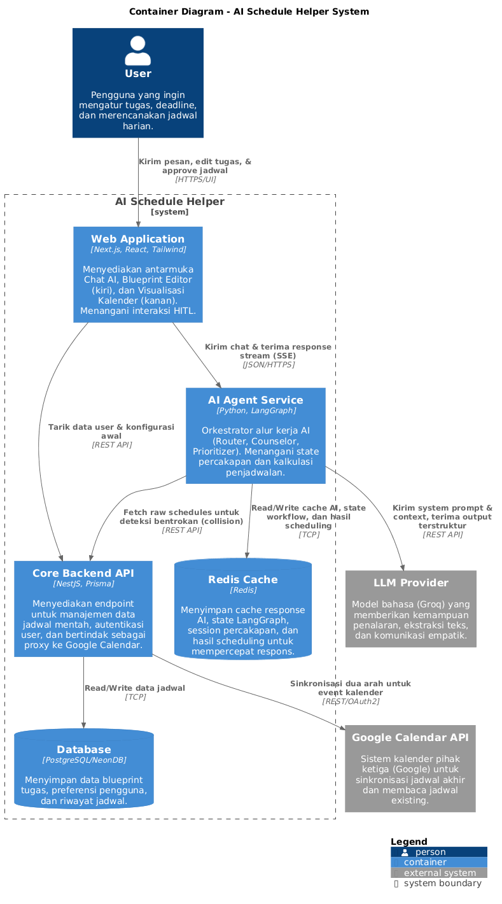
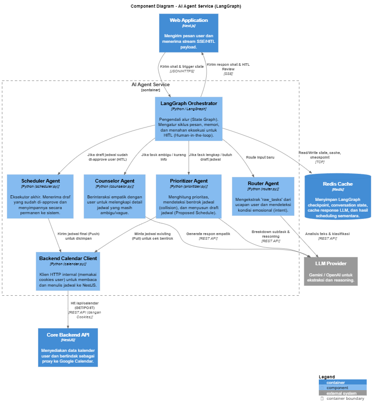

# 🚀 Schedule Helper

### AI-Powered Cognitive Assistant for Smarter Workflows

**Schedule Helper** is an AI-driven task and decision management platform designed to reduce *cognitive overload* and *decision fatigue* in modern digital work environments.

Instead of acting as a traditional task manager, it functions as a **context-aware decision assistant**—adapting to the user's energy level, emotional state, and real-time context to generate realistic and actionable plans with Human-in-the-Loop (HITL) validation.

---

## 📌 Project Overview

This project is part of the **Jalin AI Services Platform** initiative in collaboration with **PT. Jalin Mayantara Indonesia**.

The goal is to build an **integrated AI platform** that enhances operational efficiency and supports intelligent decision-making across workflows.

---

## 🎯 Key Problems Addressed

### 1. Lack of Integrated AI Platform
Eliminates duplicated AI development efforts by introducing a standardized **abstraction layer**.

### 2. High Cognitive Load
Helps users organize scattered thoughts using a structured **mind dump processing system** guided by empathetic AI.

### 3. Unrealistic Prioritization
Generates plans based on **user condition (energy & mental state)** and intelligently checks for **calendar collisions** instead of relying solely on deadlines.

---

## 🏗️ System Architecture

The system follows a distributed microservices architecture tailored for real-time AI streaming and robust state management.

### Architecture Breakdown

| Layer | Description |
|---|---|
| **Web Application (Client Layer)** | Built with **Next.js, React, and Tailwind**. Provides an intuitive Chat AI interface, Blueprint Editor, and Visual Calendar. Handles the **HITL** approval process via Server-Sent Events (SSE). |
| **AI Agent Service** | Powered by **Python and LangGraph**. Acts as the orchestrator for the AI workflow—manages conversation state, routes user intents, calculates schedules, and pauses execution for user reviews. |
| **Core Backend API** | Built with **NestJS and Prisma**. Acts as the main data hub—provides endpoints for schedule management, user authentication, and serves as a proxy for **Google Calendar API** sync. |
| **Database** | **PostgreSQL (NeonDB)** for storing blueprint tasks, user preferences, and history. |
| **Cache/State** | **Redis** for storing LangGraph checkpoints (memory), conversation state, LLM response caching, and temporary scheduling results. |

---

## 🤖 Multi-Agent Workflow (LangGraph Orchestration)

The core AI engine leverages a **multi-agent state graph architecture** orchestrated by LangGraph:

### 1. Router Agent
Analyzes the user's input to extract distinct `raw_tasks` and detects their emotional state or intent (e.g., stress, overload, or neutral task management).

### 2. Counselor Agent
Engages empathetically with the user. If tasks are vague or missing crucial context (like missing duration or vague deadlines), this agent asks clarifying questions to complete the details.

### 3. Prioritizer Agent
The analytical brain. It calculates task priority levels (using methods like the Weighted Sum Model/Eisenhower Matrix), fetches existing schedules to detect collisions, and constructs a draft **Proposed Schedule**.

### 4. Scheduler Agent
The executor. Once the user approves the drafted schedule (via HITL), this agent pushes the final confirmed schedule to the backend API for permanent storage and calendar synchronization.

---

## 🛠️ Tech Stack

| Layer | Technology |
|---|---|
| **Frontend** | Next.js, React, Tailwind CSS (Vercel) |
| **Backend API** | NestJS, Prisma ORM |
| **AI Service** | Python, LangGraph |
| **LLM Provider** | Groq (Reasoning, Extraction, Interaction) |
| **Database** | PostgreSQL (NeonDB) |
| **Cache/State** | Redis |
| **Integrations** | Google Calendar API |

---

## 🧠 Key Value Proposition

- 🧩 **Context-Aware Planning** — Not just tasks, but realistic execution with collision detection.
- ⏸️ **Human-in-the-Loop (HITL)** — AI proposes, you decide. Full control over the final schedule.
- 🧠 **Cognitive Load Reduction** — Externalizes thinking into structured plans via an empathetic Router-Counselor flow.
- 🔗 **Unified AI Platform** — Reduces fragmentation in AI development across services.

---

## 👥 Team — Pencuci Ompreng MBG 😄

| Name | Role |
|---|---|
| **M. Dhifan Rizky Wardana** | UI/UX Designer & Governance Lead |
| **Muhammad Raka Fadillah** | Architecture Designer, UI/UX Designer, AI Orchestrator, Infrastructure Engineer, Agent Engineer & Fullstack Engineer |
| **Naufan Ahnaf** | Counselor Agent Engineer |
| **Shatara Belva Maritza** | Prioritizer Agent Engineer |
| **M. Rendy Adhi Pradana N. H.** | Front-End Engineer |
| **Delfan Zuffar Rajjaz Nuziar** | Infrastructure Engineer & Fullstack Engineer |

---

## 📄 License

This project is developed by students of **Faculty of Computer Science, Universitas Brawijaya** in collaboration with **PT. Jalin Mayantara Indonesia**.